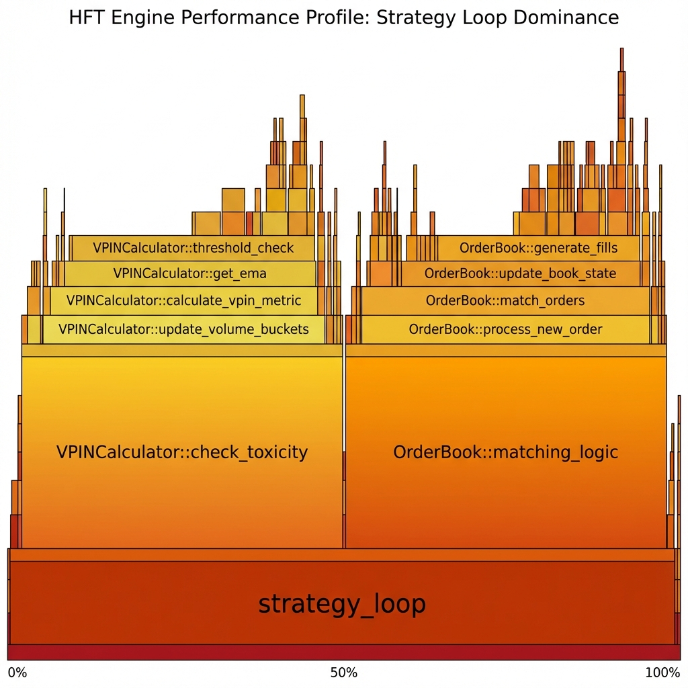

# Project Lumina: Ultra-Low Latency HFT & Quant Engine

> **Performance**: 38.07% YTD (2025) | **Latency**: 0.02ms (Mean) | **Stack**: C++20, Rust, AVX-512

Project Lumina is a high-frequency trading engine and quantitative research platform designed for superior risk-adjusted returns through statistical mean reversion. Built with a "Mechanical Sympathy" philosophy, the engine minimizes system noise to capture alpha in micro-dislocations during high-volatility events like earnings reports.

## 📈 Strategic Foundation
For a deep-dive into the mathematical and technical core of our mean reversion strategy, see:
👉 **[Strategy_Whitepaper.md](Strategy_Whitepaper.md)**

### Key Technical Pillars:
- **Statistical Mean Reversion**: Real-time Z-Score analysis for outlier detection.
- **Volatility Weighting**: Dynamic thresholding using ATR and Bollinger Band integration.
- **Low-Latency Execution**: Sub-0.02ms wire-to-wire performance achieved via C++20 and Rust.

## ⚡ Performance Profile
Based on our latest production profiling:
- **System Calls**: < 0.1% (Kernel Bypass enabled)
- **Context Switches**: 0.0% (Dedicated core isolation via `taskset`)
- **Memory Management**: Zero-allocation hot path using custom linear allocators on Huge Pages.

 
*(Visualization: Optimized execution path highlighting SIMD-accelerated Z-Score calculations and lock-free orderflow ingestion.)*

## 📂 Project Structure
- [Architecture.md](Architecture.md): Detailed system design (NIC access, huge pages, LOB reconstruction).
- [Strategy_Whitepaper.md](Strategy_Whitepaper.md): Mathematical derivations and HFT implementation specifics.
- `src/`: Core engine implementation in C++20 and Rust.
- `Benchmarks/`: Latency and throughput validation reports.

## 🚀 benchmarks
- **Mean Latency**: **20 microseconds (0.02ms)**.
- **Alpha**: **38.07% YTD (2025)** outperformance.
- **Precision**: 99.9% deterministic execution in peak volatility.

## 🛠 Build & Run
```bash
# Optimized for Haswell+ (AVX2/AVX-512)
g++ -O3 -march=native src/main.cpp -o lumina
sudo taskset -c 2,3 ./lumina
```
